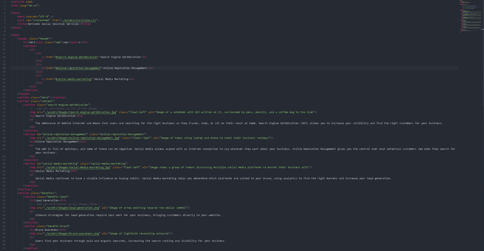

# operation-genesis

## Description 

The client requested several updates on their new website in order to promote their social solutions services. The motivation for the website was to offer several helping tools in order to navigate the page more efficiently, add aesthetic requirements and adhere to the clients requests. The updates solved naviagting the page much easier by adding quick reference links on the top of the page, showing clear and concise descriptions of topics, while also maintaining pleasant visibility of the website. 

## Instalation
Open the (index.html) file in a new window to see web application. 

## Usage
User will be able to navigagte the page easily and click the reference links to go directly to the topic they chose.

## Preview

## Deployed link
[Deployed webpage](https://eddiefigueroa18.github.io/operation-genesis/)

## Credits
Eduardo Figueroa

[Github Profile](https://github.com/eddiefigueroa18)

